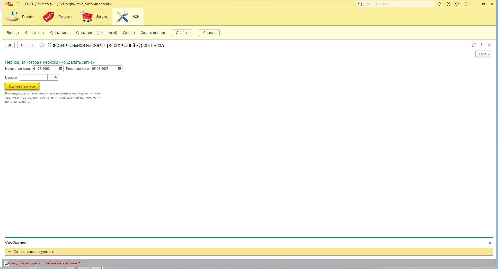
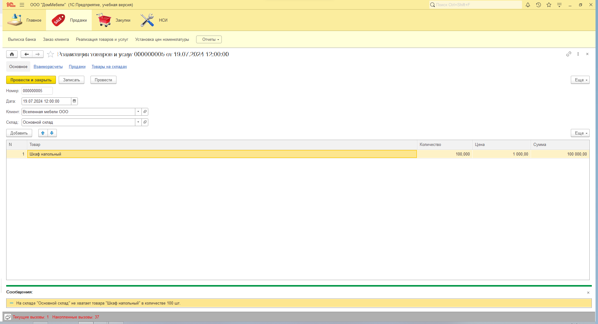
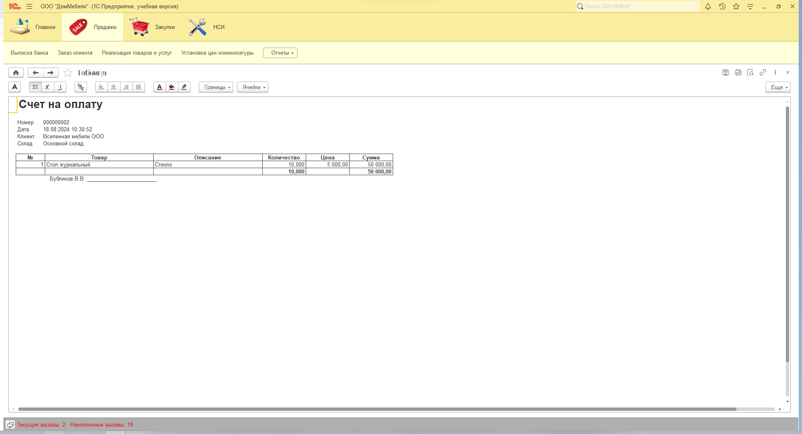
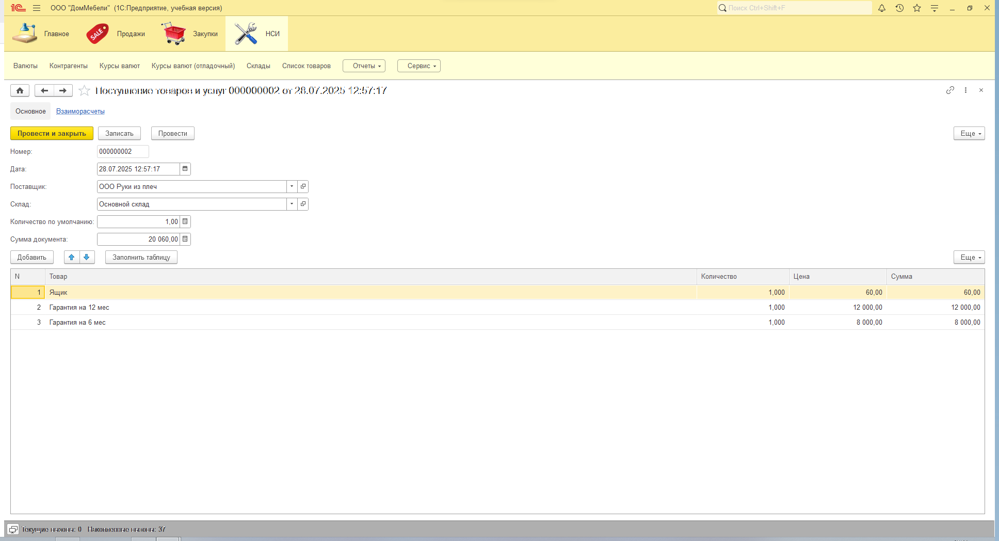

# Комплексная доработка конфигурации 1С: доработка отчёта, создание обработки очистки регистра сведений, печатные формы и бизнес-ограничения

## Описание задачи

Тестовое задание выполнено для проверки навыков 1С-разработки. Основная цель — продемонстрировать умение работать с регистрами сведений, обработками, печатными формами и реализацией бизнес-ограничений в типовых документах.

### Исходные данные

* Платформа: 1С:Предприятие 8.3
* Конфигурация: учебная база (файл ИсходнаяБазаДанных.dt)

## Описание функционала

### 1. Обработка для очистки регистра сведений "Курсы валют"

* Возможность удалить записи:

  * за выбранный период;
  * по выбранной валюте.
* Обработка встроена в подсистему НСИ.

### 2. Ограничения выбора и проведение документа "Реализация товаров и услуг"

* В табличной части разрешено выбирать только номенклатуру с типом "Товар" или "Услуга".
* Запрет на запись и проведение документа при выборе номенклатуры другого типа.
* При проведении выполняется проверка остатков на складах. При нехватке — проведение запрещается, выводится информационное сообщение.

### 3. Модификация печатной формы "Счёт на оплату" документа "Заказ клиента"

* Добавлены колонки:

  * "Описание товара" — выводится из справочника "Номенклатура".
  * "Итого" — отображает итоговую сумму и количество по всем строкам.
* Данные по складу перенесены в шапку документа, под информацию о клиенте.
* Повторяющиеся позиции номенклатуры сворачиваются с подсчётом сумм.

### 4. Кнопка "Заполнить таблицу" в документе "Поступление товаров и услуг"

* Заполняет табличную часть всеми позициями номенклатуры, у которых в качестве основного поставщика указан поставщик из шапки документа.
* Количество берётся из реквизита "Количество по умолчанию".
* Цена берётся из регистра сведений на дату документа.
* Сумма рассчитывается программно.
* Обеспечен автоматический пересчёт суммы документа при изменении данных.
* Установлен запрет на пустое значение номенклатуры в табличной части.

## Структура репозитория

```
/1С-Projects/
  /КурсыВалютИРеализация/
    /Скриншоты/                    — изображения интерфейсов
    README.md                      — описание проекта
    ИсходнаяБазаДанных.dt          — исходная база данных
    КомплекснаяДоработка.dt        — выгрузка базы с решением
```

## Скриншоты



**Рисунок 1. Обработка очистки регистра сведений «Курсы валют»**



**Рисунок 2. Документ «Реализация товаров и услуг» сообщение о нехватке остатков при проведении**



**Рисунок 3. Документ «Заказ клиента» (печатная форма счёта)**



**Рисунок 4. Документ «Поступление товаров и услуг» кнопка «Заполнить таблицу»**

## Как использовать

1. Создайте учебную информационную базу на платформе 1С 8.3.
2. Через меню Администрирование → Загрузить информационную базу из файла загрузите файл `КомплекснаяДоработка.dt`.
3. Проверьте:

   * обработку очистки регистра "Курсы валют" в подсистеме НСИ;
   * ограничения в документе "Реализация товаров и услуг";
   * обновлённую печатную форму "Счёт на оплату" в документе "Заказ клиента";
   * кнопку "Заполнить таблицу" в документе "Поступление товаров и услуг".

## Цель проекта

* Продемонстрировать навыки работы с регистрами сведений, обработками и печатными формами.
* Реализовать проверки бизнес-логики: допустимость выбора, контроль остатков, автоматические вычисления.
* Интегрировать доработки в существующую конфигурацию с соблюдением архитектурных принципов платформы 1С.
